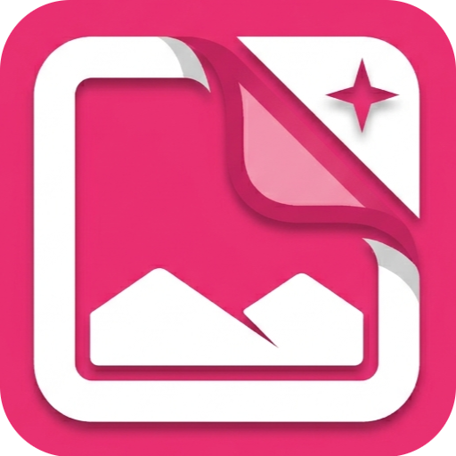

#  WondayWall

予定や関心を反映した壁紙を生成する Windows 向けパーソナル壁紙アプリ

カレンダーの予定・RSS ニュース・興味キーワードをもとに、Gemini API が毎日あなた向けの壁紙を生成します。
単なるスライドショーではなく、**その日の自分に寄り添う景色**をデスクトップに映します。

## 必要な環境

- Windows 10 / 11
- [.NET 10 Runtime](https://dotnet.microsoft.com/download/dotnet/10.0)
- Google カレンダー連携
- Google AI API キー

## セットアップ

1. リリースページから `WondayWall.exe` をダウンロード
2. 起動するとセットアップ画面が表示される
3. **Google AI API キー** を設定
4. **Google Calendar** の認証を行う（初回起動時にブラウザが開きます）
5. 興味キーワードと RSS フィード URL を登録
6. 「今すぐ生成」で動作確認

定期実行するには、アプリの設定画面で **1日あたりの更新回数** を選び、**タスクスケジューラ** に下記コマンドを登録します。

```
WondayWall.exe run-once
```

## 機能

| 機能 | 説明 |
|------|------|
| 壁紙自動生成 | カレンダー・ニュース・キーワードをもとに Gemini で壁紙を AI 生成 |
| Google Calendar 連携 | 当日〜近日の予定を壁紙の雰囲気に反映 |
| RSS ニュース連携 | 指定フィードの最新記事を壁紙テーマに反映 |
| 手動生成 | GUI から即時生成可能 |
| 生成履歴 | 過去の壁紙を一覧で確認 |
| CLI モード | `run-once` / `generate` でタスクスケジューラや手動実行から呼び出し可能 |

## CLI コマンド

```powershell
WondayWall.exe run-once          # 設定した更新回数に応じた現在の定刻枠が未処理なら1回生成して終了（タスクスケジューラ向け）
WondayWall.exe generate          # 即時生成
WondayWall.exe check-calendar    # カレンダー取得のみ確認
WondayWall.exe check-news        # ニュース取得のみ確認
WondayWall.exe check-google-ai   # Gemini API 接続確認
```

## データ保存先

| 種別 | パス |
|------|------|
| 設定ファイル | `%AppData%\WondayWall\appsettings.json` |
| 生成履歴 | `%AppData%\WondayWall\history.json` |
| 生成画像 | `%AppData%\WondayWall\images\` |
| OAuth トークン | `%AppData%\WondayWall\calendar-token\` |

## スケジュール

- 1日あたりの更新回数は `1 / 2 / 3 / 4 / 6 / 8 / 12 / 24` 回から選択できます
- 実行時刻は 24 時間を等分した固定時刻になります
- 例: `1回` は `0:00`、`2回` は `0:00 / 12:00`、`4回` は `0:00 / 6:00 / 12:00 / 18:00`
- 定刻を逃した場合だけ、次回ログオン時に `run-once` が未処理枠を補完実行します

## 開発者向け

```powershell
git clone https://github.com/Freeesia/WondayWall.git
cd WondayWall/WondayWall
dotnet build
```

詳細は [dev.md](dev.md) を参照。

## ライセンス

[MIT License](LICENSE)

