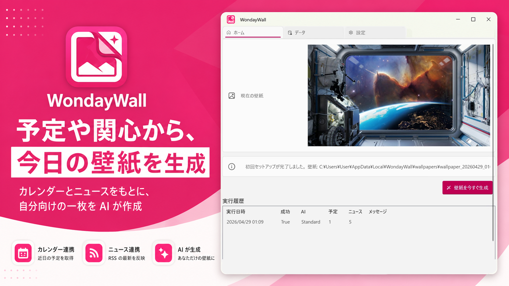
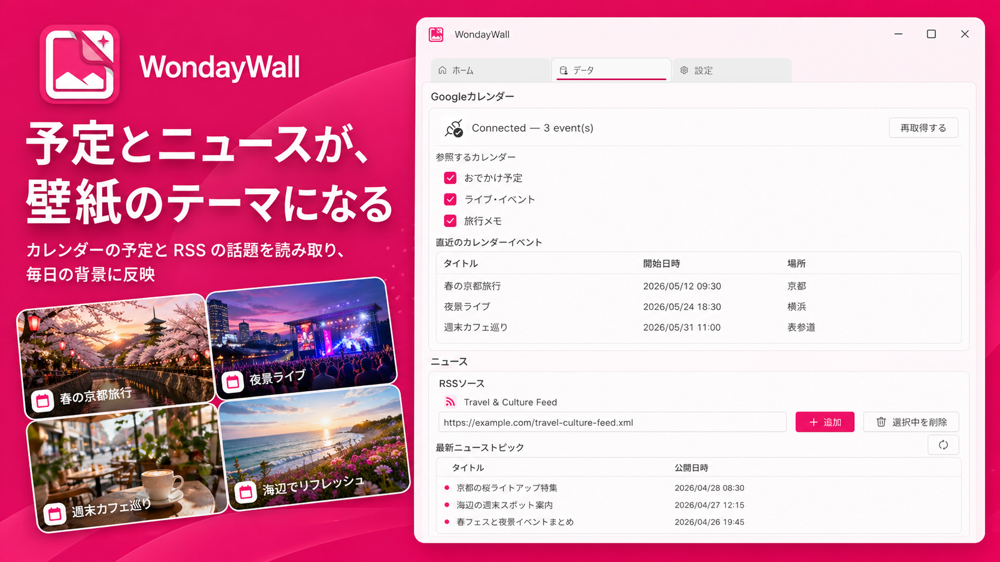

# WondayWall

[日本語](README.md) | [English](README.en.md)

A personal wallpaper app for Windows that generates wallpapers based on your schedule and interests.

WondayWall uses Gemini API to generate wallpapers from your calendar events, RSS news, and interest keywords.
Instead of showing a simple slideshow, it brings a scene that reflects your day to your desktop.

## Screenshots

<p align="center">
  
</p>

<p align="center">
  
  
  
</p>

<p align="center">
  
</p>

## Requirements

- Windows 10 / 11
- [.NET 10 Runtime](https://dotnet.microsoft.com/download/dotnet/10.0)
- Google Calendar integration
- Google AI API key

## Setup

1. Download `WondayWall-(version).msi` from the [releases page](https://github.com/Freeesia/WondayWall/releases/latest)
2. Run the downloaded MSI and follow the installer prompts
3. Launch the installed WondayWall app to open the setup screen
4. Configure your **Google AI API key**
5. Authorize **Google Calendar** (a browser opens during the first setup)
6. Register your interest keywords and RSS feed URLs
7. Use "Generate now" to verify that wallpaper generation works

For scheduled updates, select **runs per day** in the app settings and register the following command in Task Scheduler.

```powershell
WondayWall.exe run-once
```

## Features

| Feature | Description |
|---------|-------------|
| Automatic wallpaper generation | Generates wallpapers with Gemini based on calendar events, news, and keywords |
| Google Calendar integration | Reflects today's and upcoming events in the wallpaper mood |
| RSS news integration | Reflects recent articles from configured feeds in the wallpaper theme |
| Manual generation | Generates a wallpaper immediately from the GUI |
| Generation history | Shows previously generated wallpapers |
| CLI mode | Supports `run-once` and `generate` for Task Scheduler and manual execution |

## CLI Commands

```powershell
WondayWall.exe run-once          # Generate once only if the current scheduled slot has not been processed
WondayWall.exe generate          # Generate immediately
WondayWall.exe check-calendar    # Check calendar access
WondayWall.exe check-news        # Check news feed access
WondayWall.exe check-google-ai   # Check Gemini API access
```

## Data Storage

| Data | Path |
|------|------|
| Settings file | `%LocalAppData%\StudioFreesia\WondayWall\config.json` |
| Generation history | `%LocalAppData%\StudioFreesia\WondayWall\history.json` |
| Generated images | `%LocalAppData%\StudioFreesia\WondayWall\wallpapers\` |
| OAuth tokens | `%LocalAppData%\StudioFreesia\WondayWall\calendar-token\` |

## Schedule

- Runs per day can be selected from `1 / 2 / 3 / 4 / 6 / 8 / 12 / 24`
- Run times are fixed slots that divide 24 hours evenly
- Examples: `1` run is `0:00`, `2` runs are `0:00 / 12:00`, and `4` runs are `0:00 / 6:00 / 12:00 / 18:00`
- If a scheduled slot is missed, `run-once` catches up only the pending slot at the next logon

## Development

```powershell
git clone https://github.com/Freeesia/WondayWall.git
cd WondayWall/WondayWall
dotnet build
```

See [dev.md](https://github.com/Freeesia/WondayWall/blob/main/dev.md) for development details.

## Legal

[Privacy Policy](PrivacyPolicy.en.md)

[Terms of Use](Terms_of_Use.en.md)

## License

[MIT License](https://github.com/Freeesia/WondayWall/blob/main/LICENSE)
