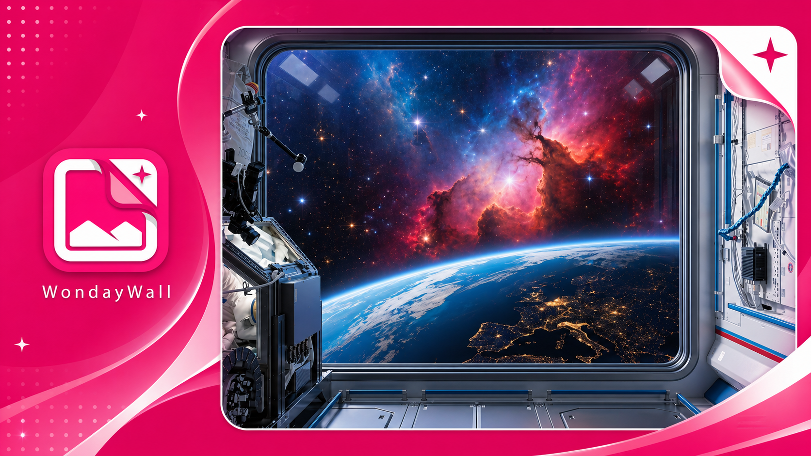
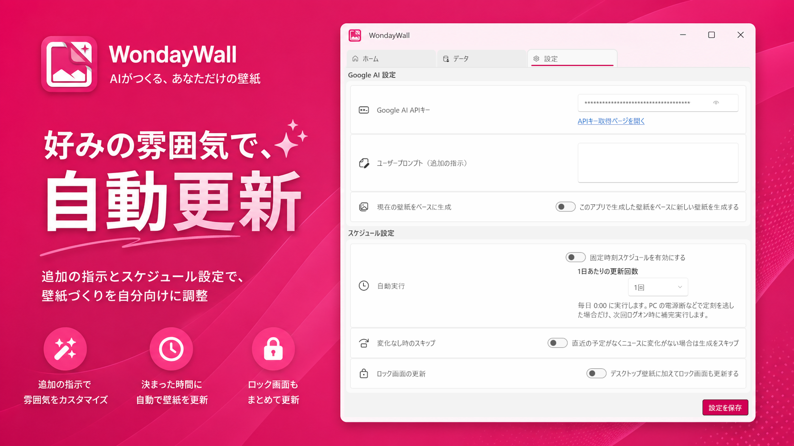

# WondayWall

[日本語](README.md) | [English](README.en.md)

予定やニュース、興味キーワードをもとに壁紙画像を生成する Windows / iOS / Android 向けパーソナル壁紙アプリです。

WondayWall は Gemini API を使って、その日の予定や関心に合わせた壁紙候補を生成します。Windows と Android では OS が許可する範囲で壁紙へ適用し、iOS では写真ライブラリ保存・共有・設定手順の表示により、ユーザーが手動で壁紙に設定できる状態にします。

## 画面イメージ

以下は Windows 版の画面イメージです。

<p align="center">
  
</p>

<p align="center">
  
  
  
</p>

<p align="center">
  
</p>

## 対応状況

| OS | 対応内容 |
|----|----------|
| Windows | デスクトップ版。GUI と CLI を備え、Task Scheduler による定期生成に対応 |
| iOS | iPhone 向け。iOS の制約により壁紙の直接変更は行わず、写真保存・共有・設定手順表示で対応 |
| Android | Android 端末向け。`WallpaperManager` によるホーム画面壁紙への適用に対応 |

## 必要な環境

| OS | 必要なもの |
|----|------------|
| Windows | Windows 10 / 11、[.NET 10 Runtime](https://dotnet.microsoft.com/download/dotnet/10.0)、Google AI API キー、Google Calendar 連携 |
| iOS | iOS 17.0 以降、Google AI API キー、カレンダー・写真・通知への許可 |
| Android | Android 8.0 以降、Google AI API キー、カレンダー・通知・壁紙設定への許可 |

## セットアップ

### Windows

1. [リリースページ](https://github.com/Freeesia/WondayWall/releases/latest)から `WondayWall-(バージョン).msi` をダウンロード
2. ダウンロードした MSI を実行し、インストーラーの案内に従ってインストール
3. インストールした WondayWall を起動するとセットアップ画面が表示される
4. **Google AI API キー** を設定
5. **Google Calendar** の認証を行う
6. 興味キーワードと RSS フィード URL を登録
7. 「今すぐ生成」で動作確認

定期実行するには、アプリの設定画面で **実行頻度** を選び、Windows Task Scheduler に下記コマンドを登録します。

```powershell
WondayWall.exe run-once
```

### iOS

1. アプリを起動し、**Google AI API キー** を設定
2. iOS カレンダーへのアクセスを許可し、参照するカレンダーを選択
3. 興味キーワードと RSS フィード URL を登録
4. 写真ライブラリ保存や通知を使う場合は、必要な許可を付与
5. 「今すぐ生成」で壁紙候補を生成

iOS では通常のアプリからホーム画面・ロック画面の壁紙を直接変更できないため、生成画像を写真ライブラリへ保存し、共有またはアプリ内の手順表示に従って手動で壁紙に設定します。

### Android

1. アプリを起動し、**Google AI API キー** を設定
2. 端末カレンダーへの読み取り権限を許可し、参照するカレンダーを選択
3. 興味キーワードと RSS フィード URL を登録
4. 通知やギャラリー保存に必要な許可を付与
5. 「今すぐ生成」で壁紙を生成し、ホーム画面へ適用

Android では端末に同期済みのカレンダー予定を Calendar Provider / `CalendarContract` から取得します。初期版では Google Calendar API や Google OAuth による予定取得は行いません。

## 機能

| 機能 | Windows | iOS | Android |
|------|---------|-----|---------|
| Gemini による壁紙生成 | 対応 | 対応 | 対応 |
| 手動生成 | GUI から即時生成 | アプリから即時生成 | アプリから即時生成 |
| 定期生成 | Task Scheduler + CLI | `BGProcessingTask` + 起動/復帰時補完 | WorkManager + 起動/復帰時補完 |
| カレンダー取得 | Google Calendar API | iOS カレンダー | Calendar Provider / `CalendarContract` |
| RSS ニュース取得 | 対応 | 対応 | 対応 |
| 壁紙適用 | デスクトップ壁紙、設定によりロック画面 | 自動適用不可。写真保存・共有・設定手順表示 | ホーム画面、設定によりロック画面にも追加適用 |
| 生成履歴 | 対応 | 対応 | 対応 |
| CLI | `run-once` / `generate` / `check-*` | 非対応 | 非対応 |

## CLI コマンド（Windows）

```powershell
WondayWall.exe run-once          # 設定した実行頻度に応じた現在のスケジュール枠が未処理なら1回生成して終了（Task Scheduler 向け）
WondayWall.exe generate          # 即時生成
WondayWall.exe check-calendar    # Google Calendar 取得のみ確認
WondayWall.exe check-news        # ニュース取得のみ確認
WondayWall.exe check-google-ai   # Gemini API 接続確認
```

## 保存先・保存方法

| OS | 保存される情報 |
|----|----------------|
| Windows | 設定、生成履歴、生成画像、Google Calendar OAuth トークンを `%LocalAppData%\StudioFreesia\WondayWall\` 配下に保存。Google AI API キーは Windows 資格情報に保存 |
| iOS | アプリ内設定、生成履歴、生成画像をアプリ領域に保存。Google AI API キーは Keychain に保存。写真保存を有効にした場合は写真ライブラリの WondayWall アルバムにも保存 |
| Android | アプリ設定を DataStore、生成履歴と生成画像をアプリ領域に保存。Google AI API キーは Tink と Android Keystore を使って暗号化保存。必要に応じて写真/ギャラリーへ保存 |

## スケジュール

全プラットフォーム共通で、実行頻度（週1回 / 週2回 / 週3回 / 1日1回 / 1日3回）を選択して定期実行します。

| OS | 実行方式 |
|----|----------|
| Windows | 設定した頻度に基づくスケジュール枠で Task Scheduler から `run-once` を実行し、未処理分を生成 |
| iOS | 設定した頻度に基づくスケジュール枠を `BGProcessingTask` に登録し、起動時やフォアグラウンド復帰時にも未処理分を補完生成 |
| Android | 設定した頻度に基づくスケジュール枠を `WorkManager` に登録し、起動時やフォアグラウンド復帰時にも未処理分を補完生成 |

iOS と Android のバックグラウンド実行は OS の制御を受けるため、指定時刻での実行を保証するものではありません。

## 開発者向け

```powershell
git clone https://github.com/Freeesia/WondayWall.git
cd WondayWall/WondayWall
dotnet build
```

プラットフォーム別の詳細は次のドキュメントを参照してください。

- [.NET / Windows: dev.md](https://github.com/Freeesia/WondayWall/blob/main/dev.md)
- [iOS: dev_ios.md](https://github.com/Freeesia/WondayWall/blob/main/dev_ios.md)
- [Android: dev_android.md](https://github.com/Freeesia/WondayWall/blob/main/dev_android.md)

## 法的情報

[プライバシーポリシー](PrivacyPolicy.md)

[利用規約](Terms_of_Use.md)

[生成画像の利用について](GeneratedImageUsage.md)

## ライセンス

[MIT License](https://github.com/Freeesia/WondayWall/blob/main/LICENSE)
